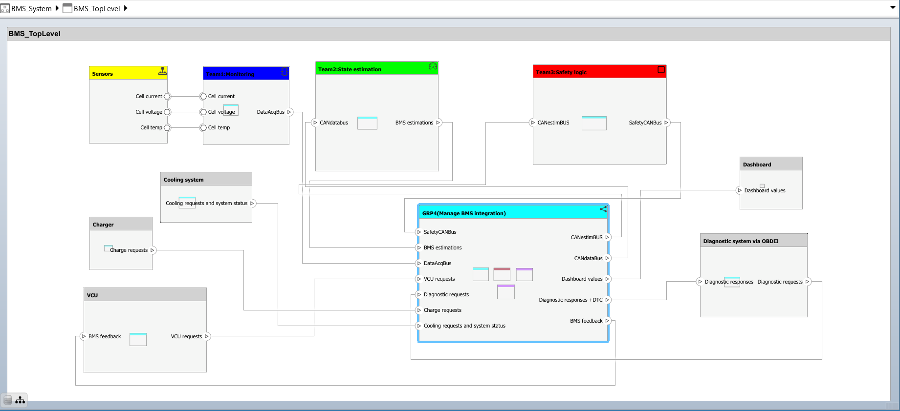
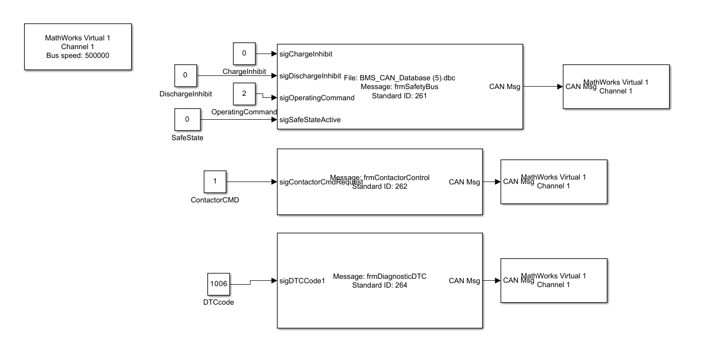
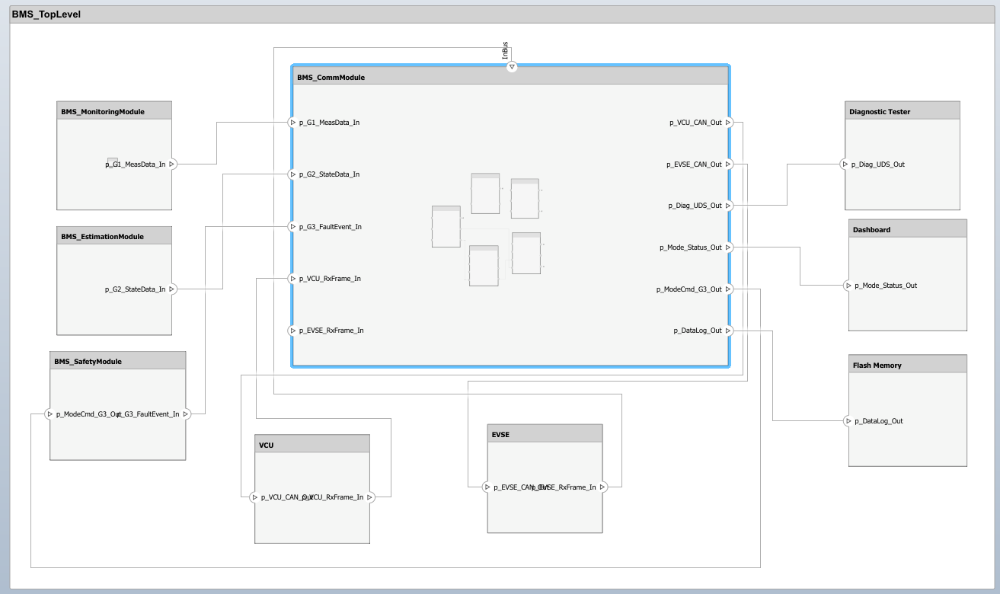
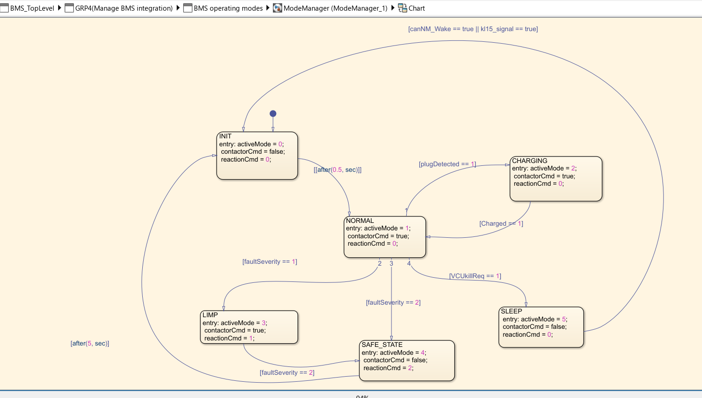
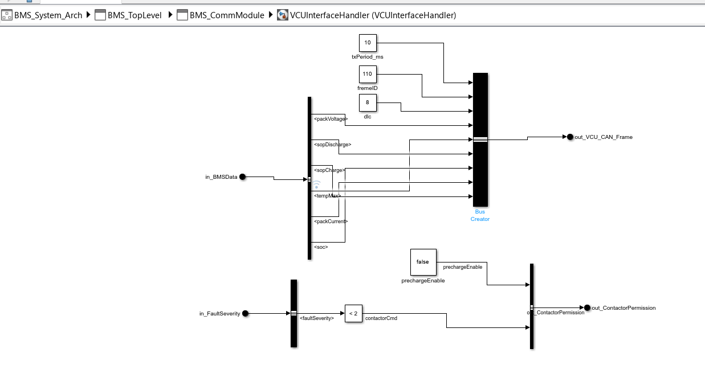

# Battery Management System (BMS) Communication and Integration

This repository contains a MATLAB Simulink-based project that models the communication and integration of a Battery Management System (BMS) for an electric vehicle, inspired by standards followed in Tesla-like architectures.

---

## Objectives

The primary goal of this project is to coordinate and integrate data across several domains within the EV system:

- **Data Acquisition:** Gathering data from vehicle sensors.
- **Battery Estimation:** Computing State of Charge (SOC), State of Power (SOP), and State of Health (SOH).
- **Diagnostics & Safety:** Implementing diagnostics and creating safety flags.
- **Vehicle Control Unit (VCU):** Interfacing BMS with the main vehicle controls.
- **Cooling System:** Communicating necessary thermal management actions.
- **Charging System:** Integration with EV charging logic.
- **Dashboard:** Presenting relevant BMS information to the driver.
- **OBD-II Diagnostic System:** Enabling diagnostics via standard On-Board Diagnostics.
- **Logging Unit:** Recording CAN messages and BMS status for analysis and traceability.

---

## System Architectures

### General Architecture

- **CAN Communication:**  
  Generates and parses CAN messages based on a DBC file for robust multi-controller communication.

- **BMS Mode Determination:**  
  Uses Stateflow (MATLAB/Simulink) and relevant inputs to determine the current BMS operating mode.

- **UDS Diagnostic Messaging:**  
  Constructs Unified Diagnostic Services (UDS) messages for advanced fault detection and diagnostics.

- **Logging Unit:**  
  Logs key data and events into an output file for analysis, diagnostics, and benchmarking.

  

---

### SAE Project Architecture

A second architecture targets SAE project-specific requirements, using a bus-based design for direct CAN message processing and explicit module separation. Key components:

- **CAN TX/RX Messages:**  
  Bus Creator-based mechanism to pack and unpack CAN transmit and receive messages directly.

- **VCU Interface Handler:**  
  Handles all interactions between the BMS and the Vehicle Control Unit.

- **Diagnostic Logger:**  
  Dedicated module for recording diagnostic and operational events to log files.

- **Charging Interface:**  
  Manages charging operations and communication with the charging infrastructure.

- **Mode & Wakeup Management:**  
  Handles system mode transitions (e.g., Awake, Sleep) and manages wakeup events.

  

  

---

## Standards & Requirements

This project adheres to a wide range of automotive and communication standards, including:

- **ISO 26262** – Road vehicles functional safety requirements
- **ISO 11898 / CAN Protocol** – Controller Area Network bus standard for automotive applications
- **ISO 14229 / UDS** – Unified Diagnostic Services for diagnostics over CAN
- **SAE J1939 & J1979** – Vehicle communication and diagnostics standards
- **OBD-II Protocol** – Standardized on-board diagnostics access
- **AUTOSAR Guidelines** – Where applicable for modeling and architecture

The codebase is 100% MATLAB/Simulink.

---

## Getting Started

1. **Clone this repository**
2. **Open Simulink Project:** Import the `*.slx` files into your MATLAB environment (version XX or later).
3. **Run Main Model:** Execute the top-level system/block to simulate complete BMS operation.

---

## Project Resources

- 📄 **Full Report**: [`final-BMS.pdf`](final-bms.pdf) (local file – contains complete details, requirements, architecture, and results)
- 📊 **Presentation**: [View on Canva](https://www.canva.com/design/DAHI1MqU0UM/Fbexys0KiTmTL1NaN13XAg/edit) (overview, diagrams, and contributors)

---

## Contribution

Contributions or collaborations are welcome. Please fork, branch, and submit a PR.

---

## License
This resource was created by students and enthusiasts, for students and enthusiasts. Feel free to use, share, or adapt it as you wish. If you have any feedback, suggestions, or corrections, we'd love to hear from you—just reach out via this account!

---

## Authors & Contributors
   - Maissa Lajmi
   - Wided Ghourabi
   - Sarra Ghachem
   - Aroua Wardi
